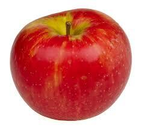

# EDGE DETECTION IN IMAGE 

## Edge detection done in an image using Sobel Operator did,nt used any Other  Python Libary

| Before Edge Detection | After Edge Detection |
|----------------------|---------------------|
|  |  |
